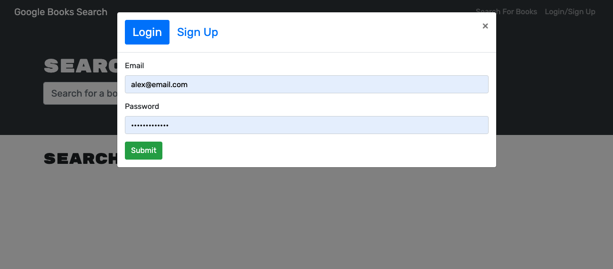
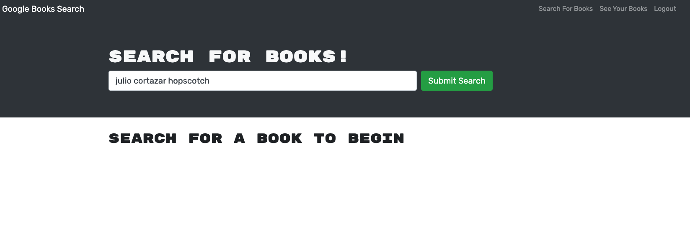
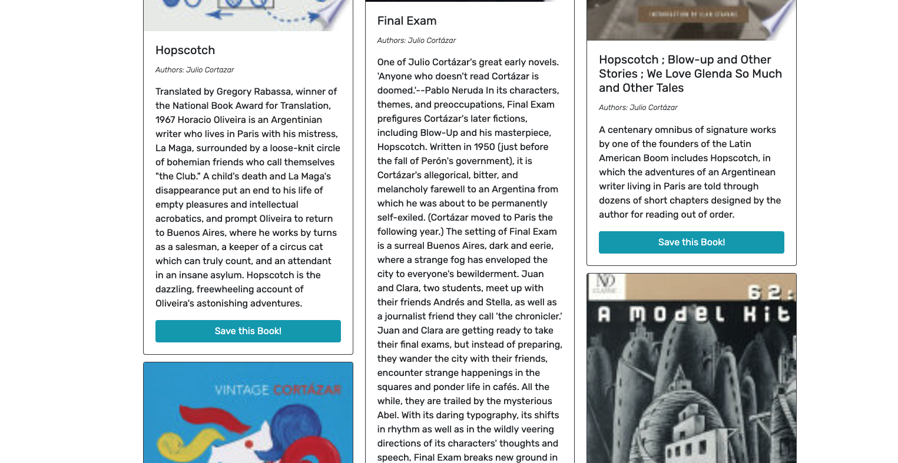
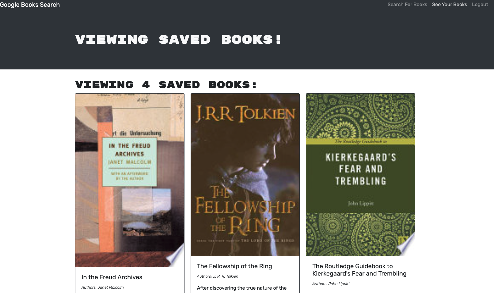

# books-r-us

## Description
Using the Google Books API, this search engine app allows users to search and save book titles and basic info on the selected books. Originally built with a RESTful API, I refactored the code to instead use a GraphQL API built with Apollo Server. My goals were to learn more about working with GraphQL, primarily, and secondarily to continue working with a full MERN Stack. This app uses React on the front-end, with the data stored in a remote MongoDB database. 

[The app is deployed here on Heroku](https://peaceful-shore-50805.herokuapp.com/)


## Table of Contents

- [Installation](#installation)
- [Usage](#usage)
- [Credits](#credits)

## Installation

The app is deployed via Heroku and requires no installation for use. 

If you'd like to run this locally, or tinker with the app yourself, download or clone the code off of this GitHub repo. Enter `npm install` from a CLI to install the dependencies and libraries you'll need, including Mongoose and Express.js and graphQL. Entering `npm run develop` will launch the app locally. Code away.

The bulk of the work done here came in refactoring the RESTful API to instead use GraphQL. Take, for example, this mutation that allows a user to login, querying the database and using a coded token to match the login info with any existing users' info.

```
export const LOGIN_USER = gql`
    mutation loginUser($email: String!, $password: String!) {
        login(email: $email, password: $password) {
        token
            user {
                _id
                username
                email
                bookCount
                savedBooks {
                    bookId
                    title
                    description
                    authors
                    link
                    image
         }
       }
     }
   }
`;
```

## Usage

Sign up or login.


Search (by author or title or both) any books you're interested in. 


Click "save this book!" to save the book you were looking for, for future reference.


Click "see your books" from the nav bar to, ahem, see your books.


Have a great day.


## Credits

The following links and documentation are just a sampling of the online resources that proved helpful as I was working on this. I also consulted with classmates in my coding bootcamp and with my tutor. 

- https://www.digitalocean.com/community/tutorials/js-intro-progressive-web-apps
- https://developer.mozilla.org/en-US/docs/Web/Manifest/background_color
- https://developer.mozilla.org/en-US/docs/Web/API/ServiceWorkerGlobalScope/skipWaiting
- https://developer.mozilla.org/en-US/docs/Web/JavaScript/Reference/Global_Objects/Promise/all
- https://stackoverflow.com/questions/36955441/indexeddb-creating-a-database-and-adding-content-failed-to-execute-transaction
- https://www.mongodb.com/developer/how-to/seed-database-with-fake-data/
- https://developer.mozilla.org/en-US/docs/Web/Manifest#example_manifest